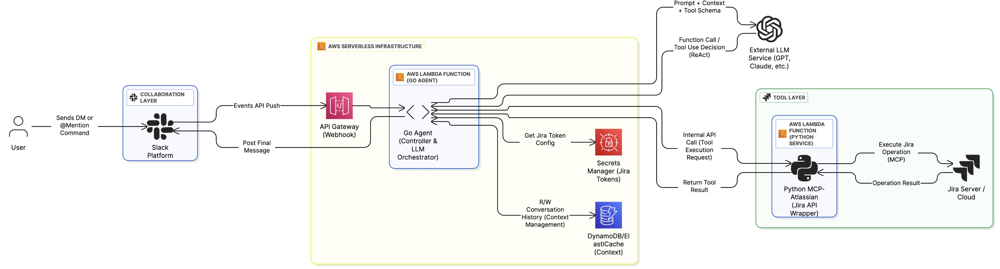

# 🤖 jira_helper: The Conversational Jira Agent

[](LICENSE)
[](https://aws.amazon.com/lambda/)
[](https://openai.com/azure)

> A powerful tool to interact with Jira through natural language commands, making Jira task management more intuitive and efficient by embedding the workflow directly into Slack conversation flow.

## 🌟 Overview

**jira_helper** 是一个强大的、基于 **LLM Agent** 的协作工具，它将 Jira 的全部功能无缝集成到您的日常 Slack 对话流中。通过自然语言指令，您可以告别繁琐的网页切换和表单填写，在 Slack 中实现 Jira 任务的**创建、查询、更新和管理**。

jira_helper 的核心价值在于：**将工作流嵌入到通信流中，显著减少上下文切换成本，提升团队协作效率。**

## ✨ Key Features

* **💬 自然语言处理 (NLP)：** 通过 Large Language Model (LLM) 驱动，理解复杂的、口语化的 Jira 命令。
* **🛠️ Agentic Tool Use (MCP Protocol)：** 基于 LLM 的 **Function Calling** 和 **Model Context Protocol (MCP)** 机制，可靠地将自然语言转化为精确的 Jira API 操作。
* **🚀 零摩擦 (Zero Friction) 体验：** 在 Slack DM 或频道中快速查看和更新 Jira Issues，无需离开聊天界面。
* **🔄 上下文感知：** 支持多轮对话，具备短期记忆能力，可以理解并执行基于历史会话的指令。
* **🔐 安全的 Token 管理：** 支持用户通过 Slack 命令安全地设置个人 Jira API Token，用于写入操作。
* **☁️ 云原生架构：** 部署在 AWS Lambda 容器中，具备高可扩展性和低运维成本。

## 🏛️ Architecture Highlights

jira_helper 采用 Go 语言构建高性能 Agent 编排器，结合 Python Tool Service 实现灵活的云原生架构。整个系统部署在 AWS Lambda 容器中。 下面是工具的期望的最终架构图.




| 组件 | 技术栈 | 职责 |
| :--- | :--- | :--- |
| **Go Agent** | Go, AWS Lambda | **Orchestrator**：Slack 事件处理、LLM 交互、上下文管理、速率限制。 |
| **MCP-Atlassian** | Python, MCP | **Tool Executor**：封装 Jira API 逻辑，由 LLM Agent 调用。 |
| **LLM Service** | Azure OpenAI | **Reasoning Core**：意图识别、Function Calling、对话推理。 |

## ⚙️ Configuration
### 📌 Required Variables

| 变量名 | 描述 | 示例 |
| :--- | :--- | :--- |
| `SLACK_BOT_TOKEN` | Slack Bot OAuth 访问令牌。 | `xoxb-xxxx` |
| `SLACK_SIGNING_SECRET` | Slack 请求签名密钥，用于安全验证。 | `xxxx-xxxx` |
| `AZURE_OPENAI_KEY` | Azure OpenAI API 密钥。 | `azure-key-12345` |
| `AZURE_OPENAI_ENDPOINT` | Azure OpenAI 服务 URL。 | `https://your-service.openai.azure.com/` |
| `AZURE_OPENAI_DEPLOYMENT` | 使用的模型部署名称 (如 gpt-4-turbo)。 | `gpt-4-turbo-deployment` |
| `MCP_SERVER_URL` | 运行 `MCP-Atlassian` 服务的 URL。 | `http://mcp-service:8080/mcp` |
| `MCP_API_KEY` | 用于 Go Agent 调用 MCP 服务的 API 密钥。 | `mcp-secret-key` |
| `TOKEN_BUCKET_NAME` | **\[当前架构]** S3 存储桶名称，用于暂存用户 Token。 | `jira-flow-config-bucket` |

### 🔑 Personal Token Management

Jira_helper 支持读写权限分离。默认情况下，Bot 以只读权限运行。对于创建 Issue、更新状态等操作，用户需要设置个人 API Token：

1.  **生成 Token：** 前往 Atlassian 账户页面，生成一个新的 API Token。
2.  **Slack 设置：** 在 Slack 中使用以下命令，将您的 Token 告知 Bot：

    ```
    /setup-token your-personal-jira-api-token-here
    ```
    您的 Token 将被加密存储并用于所有写入操作。

## 🎯 Project Roadmap (TODO)

下一步项目需要优化和重构的事项。
* **🔒 Token 存储迁移：** 将用户 Token 管理从当前的 S3 迁移到 **AWS Secrets Manager**，以满足企业级安全标准。
* **💾 记忆与状态持久化：** 引入 **DynamoDB/ElastiCache**，实现持久、高效的会话上下文管理和用户偏好存储。
* **🏗️ 架构解耦：** 将 **MCP-Atlassian Server** 从主 Agent 容器中解耦，独立部署（如单独的 Lambda 或 Fargate），增强可维护性和扩展性。
* **✂️ 高级上下文压缩：** 优化当前的上下文策略，引入 **LLM 摘要 (Summarization)** 和 **RAG 检索 (Retrieval-Augmented Generation)** 机制，防止上下文溢出，并提高多轮对话的准确性。
* **🚥 读写控制：** 完善 `READ_ONLY_MODE`，允许管理员全局禁用写入操作。
* **⏱️ 速率限制 (Rate Limiting)：** 基于 DynamoDB/Redis 完善分布式速率限制，控制 LLM 成本和 API 调用频率。

### 已完成 (Completed)

* [x] 实现基于 MCP 协议的基础 Jira API 流程。
* [x] 构建 Docker 容器镜像，实现 AWS Lambda 部署。
* [x] 支持 Slack DM 消息接收与处理。
* [x] 支持显示思考逻辑（通过编辑或回复消息）。
* [x] 优化 Issue 展示，将自定义字段翻译为人类可读格式。
* [x] 解决历史线程获取错误、Token 大小限制等问题。

## 📜 Usage

[Documentation to be added]

## 🤝 Contributing

我们欢迎任何形式的贡献！无论是 Bug 报告、功能建议，还是 Pull Request，都将帮助 **jira_helper** 发展壮大。请 feel free to 提交 Pull Request。

## 📄 License

本项目采用 MIT 许可证，详情请参阅 [LICENSE](LICENSE) 文件。